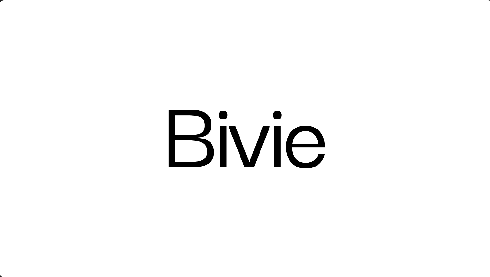

Bivie sizes vision-language model serving from a folder of your real files: it counts the exact encoder and token work each file creates, then recommends a topology (aggregated, prefill/decode split, or a separate encoder tier), GPUs per tier, and cost per 1,000 files with P10-P90 ranges. It builds on NVIDIA AIConfigurator for prefill, decode, and encoder estimates, and emits deploy configs plus a replay script that checks token counts against a live server. Run `python -m mm_sizer profile plan.example.yaml FOLDER`, then `python -m mm_sizer size plan.example.yaml`. This release is uncalibrated; the calibrated version ships next.
